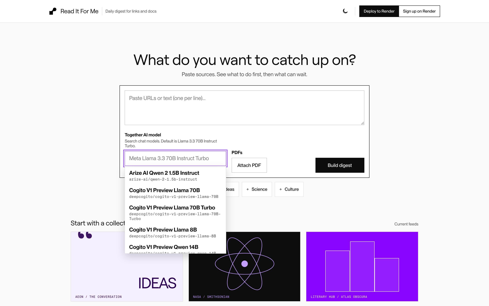
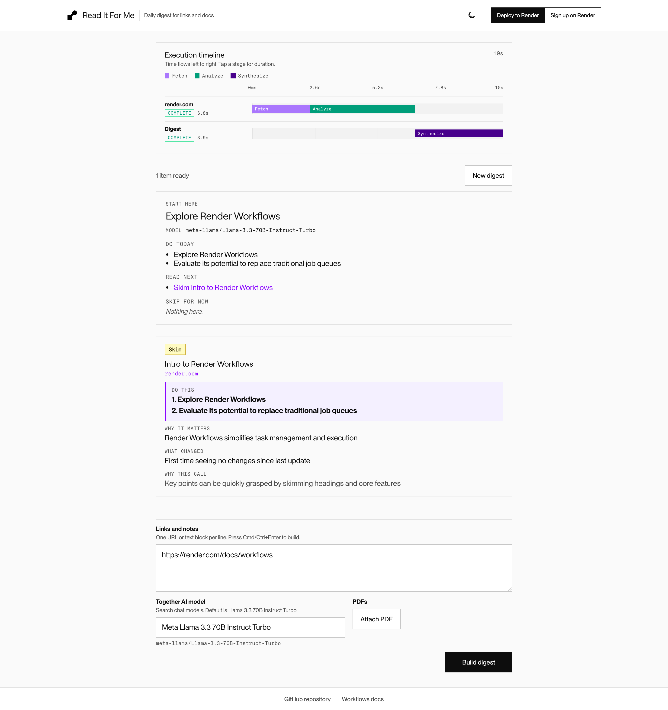

<div align="center">

# Read It For Me

Paste links, notes, or PDFs. Get action-first digest cards and a short summary of what to do, what to read, and what to skip. Inference runs on [Together AI](https://www.together.ai/) inside [Render Workflows](https://render.com/docs/workflows).

**Live demo:** [https://read-it-for-me.onrender.com/](https://read-it-for-me.onrender.com/)

<p>
  <a href="https://render.com/deploy?repo=https://github.com/render-examples/read-it-for-me-t">
    
  </a>
</p>

<p>
  <a href="https://read-it-for-me.onrender.com/">
    
  </a>
  <a href="https://render.com/docs/workflows">
    
  </a>
  <a href="https://www.together.ai/">
    
  </a>
  <a href="https://discord.gg/gvC7ceS9YS">
    
  </a>
</p>

</div>

## What This Demo Shows

This repo demonstrates how to run multi-step chat inference on Render:

| Platform | Role |
| --- | --- |
| **[Render Workflows](https://render.com/docs/workflows)** | Durable `fetch_item`, `analyze_item`, and `synthesize_digest` tasks with retries and timeouts |
| **[Together AI](https://www.together.ai/)** | Chat completions for per-item cards and the digest summary; model chosen in the UI |
| **[Render Postgres](https://render.com/docs/databases)** | Digest runs, item results, and source snapshots |
| **[Render Web Services](https://render.com/docs/web-services)** | Svelte UI, Express API, SSE streaming, and `GET /api/models` |

## Product tour

Compose a digest, watch the Workflow timeline, then read action-first cards. Screenshots from the [live demo](https://read-it-for-me.onrender.com/).

### Compose

Paste sources, search Together chat models, then build a digest.



### Results

The live Gantt shows `fetch` → `analyze` → `synthesize`. Cards lead with **Do this**, then why it matters, what changed, and a `read` / `skim` / `skip` call. The summary lists what to do today, read next, and skip.



### How a digest runs

1. **Browser** starts a digest from the composer
2. **Web service** persists the run, streams SSE, and dispatches Workflow tasks
3. **Render Workflows** executes the pipeline:

| Workflow task | What it does |
| --- | --- |
| `fetch_item` | Loads URL / text / PDF content for one source |
| `analyze_item` | Together chat → one action-first card |
| `synthesize_digest` | Together chat → headline plus `doToday`, `readNow`, `skip` |

4. Cards and stage events stream into the UI as each task finishes

## Quick Start

### Prerequisites

- [Render account](https://dashboard.render.com/register?utm_source=github&utm_medium=referral&utm_campaign=ojus_demos&utm_content=readme_link)
- [Together AI API key](https://api.together.ai/)
- [Render API key](https://render.com/docs/api#1-create-an-api-key)

### Deploy

1. Click **Deploy to Render** above (or apply [`render.yaml`](render.yaml))
2. Set secrets when prompted: `RENDER_API_KEY`, `TOGETHER_API_KEY`
3. Create the Workflow service manually (Blueprints do not create Workflows yet):
   - Dashboard → **New** → **Workflow** (same repo, same region as web + Postgres)
   - Build: `npm install && npm run build`
   - Start: `node dist/workflow/index.js`
   - Slug: `read-it-for-me-workflow` (or set `WORKFLOW_SLUG` on the web service to match)
   - Env: `TOGETHER_API_KEY`, `DATABASE_URL`, optional `TOGETHER_MODEL`
4. Open the web service URL, paste a URL, and click **Build digest**

Use the same Together key on **web** (model catalog) and **Workflow** (inference). Confirm `GET /api/models` returns `"source":"together"`.

Default model: `meta-llama/Llama-3.3-70B-Instruct-Turbo`. PDF uploads are accepted; text extraction is still an MVP placeholder.

## Features

| Feature | Description |
| --- | --- |
| **Action-first cards** | Each item leads with **Do this**, then why, what changed, and a `read` / `skim` / `skip` call |
| **Together model picker** | Searchable chat models from Together; selected model runs analyze and synthesize |
| **Live Workflow timeline** | SSE-driven left-to-right Gantt (`fetch` → `analyze` → `synthesize`) |
| **Change tracking** | Postgres snapshots compare repeat sources against the last digest |
| **Split responsibilities** | Web orchestrates; Together inference stays inside Workflow tasks |

## Configuration

| Variable | Where | Description |
| --- | --- | --- |
| `DATABASE_URL` | Web | Render Postgres connection string |
| `TOGETHER_API_KEY` | Web + Workflow | Web: model catalog. Workflow: inference |
| `RENDER_API_KEY` | Web | Start and poll workflow tasks |
| `TOGETHER_MODEL` | Both (optional) | Default chat model |
| `WORKFLOW_SLUG` | Web | Must match the Dashboard workflow slug |
| `ENABLE_WORKFLOW_TIMELINE` | Web | Set `0` to hide the Gantt |

## Project Structure

```
frontend/src/     Svelte 5 UI (composer, ModelPicker, cards, timeline)
server/           Express API, orchestrator, SSE, Postgres, models route
workflow/         fetch_item, analyze_item, synthesize_digest
shared/           Types and Render URL helpers
render.yaml       Blueprint (web + Postgres)
```

| Concern | Where to edit |
| --- | --- |
| Prompts / JSON shape | `workflow/tasks/analyze.ts`, `workflow/tasks/synthesize.ts` |
| Model catalog | `server/lib/together-models.ts` |
| SSE / orchestration | `server/lib/orchestrator.ts` |
| UI copy | `frontend/src/lib/copy.ts` |

`POST /api/digest` accepts multipart (`urls`, `text`, optional `model`, optional `pdfs`) and streams SSE. `GET /api/models` returns the picker catalog.

## Troubleshooting

| Problem | Solution |
| --- | --- |
| Picker shows one model / `source: fallback` | Set `TOGETHER_API_KEY` on the **web** service and redeploy |
| Digests fail to start | Set `RENDER_API_KEY` and `DATABASE_URL` on the web service |
| Tasks fail / wrong workflow | Match `WORKFLOW_SLUG` to the Dashboard slug |
| Together errors on analyze/synthesize | Set `TOGETHER_API_KEY` on the **Workflow** service |
| `Failed to fetch URL: HTTP 403` | Site blocks scrapers; paste the text instead |
| PDF content is generic | Expected in MVP until extraction is wired |

Logs: web service and Workflow service logs in the Render Dashboard.

## Tests

```bash
npm test
npm run build
```

## Learn More

**Render:** [Workflows](https://render.com/docs/workflows) · [Postgres](https://render.com/docs/databases) · [Deploy button](https://render.com/docs/deploy-to-render-button) · [Discord](https://discord.gg/gvC7ceS9YS)

**Together AI:** [Docs](https://docs.together.ai/) · [Models](https://www.together.ai/models)

**This repo:** [Live demo](https://read-it-for-me.onrender.com/) · [GitHub](https://github.com/render-examples/read-it-for-me-t)

## License

[MIT](LICENSE)
