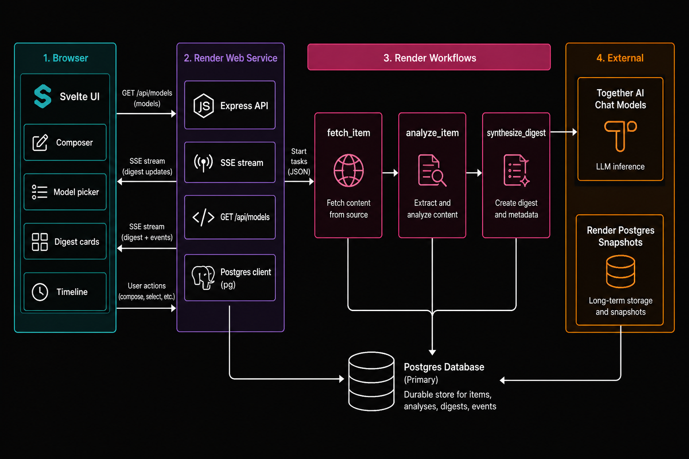
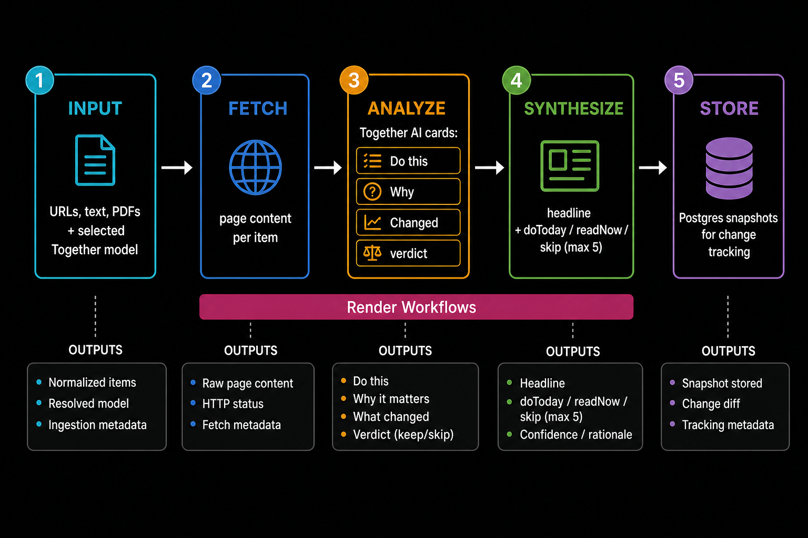

# Read It For Me

[](https://read-it-for-me.onrender.com/)

Paste links, notes, or PDFs. Get action-first digest cards and a short summary of what to do, what to read, and what to skip. Inference runs on [Together AI](https://www.together.ai/) inside [Render Workflows](https://render.com/docs/workflows).

[Live demo](https://read-it-for-me.onrender.com/) · [GitHub](https://github.com/render-examples/read-it-for-me-t) · [Workflows docs](https://render.com/docs/workflows)

<p align="left">
  <a href="https://render.com/deploy?repo=https://github.com/render-examples/read-it-for-me-t">
    
  </a>
</p>

Built with [ Svelte 5](https://svelte.dev/), [ Express](https://expressjs.com/), [ Render Workflows](https://render.com/docs/workflows), and [ Render Postgres](https://render.com/docs/postgresql).

Inference by [ Together AI](https://www.together.ai/).

## Table of contents

- [Highlights](#highlights)
- [What this demo shows](#what-this-demo-shows)
- [Overview](#overview)
- [Architecture](#architecture)
- [Usage](#usage)
- [Deploy on Render](#deploy-on-render)
- [Configuration](#configuration)
- [Operations](#operations)
- [Project structure](#project-structure)
- [Troubleshooting](#troubleshooting)
- [License](#license)

## Highlights

- **Action-first cards**: each item leads with **Do this**, then why it matters, what changed, and a `read` / `skim` / `skip` call. Summary lists cap at 5.
- **Together model picker**: searchable list of Together chat models from `GET /v1/models`. The selected model runs analyze and synthesize.
- **Live Workflow timeline**: Server-Sent Events drive a detachable left-to-right Gantt (`fetch` → `analyze` → `synthesize`).
- **Change tracking**: Postgres snapshots compare repeat sources against the last digest.
- **Split responsibilities**: the web service orchestrates; Together inference stays inside Workflow tasks.

## What this demo shows

| Piece | Role |
| --- | --- |
| **[Render Workflows](https://render.com/docs/workflows)** | Durable `fetch_item`, `analyze_item`, and `synthesize_digest` tasks with retries and timeouts |
| **[Together AI](https://www.together.ai/)** | Chat completions for per-item cards and the digest summary; model chosen in the UI |
| **[Render Postgres](https://render.com/docs/postgresql)** | Digest runs, item results, and source snapshots |
| **[Render Web Services](https://render.com/docs/web-services)** | Svelte UI, Express API, SSE streaming, and `GET /api/models` |

## Overview

Read It For Me turns a pile of reading into decisions. Paste URLs (one per line), text blocks, or PDFs, pick a Together chat model if you want something other than the default, and build a digest. Cards stream in as each item finishes. When analysis completes, a synthesis pass returns a headline plus `doToday`, `readNow`, and `skip` lists.

Default model: `meta-llama/Llama-3.3-70B-Instruct-Turbo` (override with the picker or `TOGETHER_MODEL`).

**MVP limits:** PDF uploads are accepted, but text extraction is still a placeholder. The Workflow service is created in the Dashboard (not in `render.yaml`), same pattern as other Workflows examples in this workspace.

## Architecture





| Layer | Folder | Role |
|-------|--------|------|
| UI | `frontend/` | Composer, model picker, SSE client, cards, timeline |
| API | `server/` | Express routes, orchestrator, Postgres, static SPA |
| Tasks | `workflow/` | `fetch_item`, `analyze_item`, `synthesize_digest` |
| Contracts | `shared/` | Types and Render URL helpers |

## Usage

### Web UI

1. Open the [live demo](https://read-it-for-me.onrender.com/).
2. Pick a topic chip or collection, or paste URLs / text / PDFs.
3. Optionally search and select a Together chat model.
4. Click **Build digest**. Cards stream in; the summary appears at the end.
5. Use **New digest** to start over. Detach the timeline for a larger Gantt view.

### API

`POST /api/digest` accepts `multipart/form-data`:

| Field | Type | Notes |
|-------|------|-------|
| `urls` | string | Newline-separated URLs (max 20 lines) |
| `text` | string | Newline-separated text blocks |
| `model` | string | Optional Together chat model id |
| `pdfs` | file[] | Optional PDFs, max 5 files, 3 MB each |

SSE events: `status`, `activity`, `progress`, `stage`, `card`, `done`, `error`.

`GET /api/models` returns `{ models, defaultModel, source }` for the picker (`source` is `together` or `fallback`).

```bash
curl https://read-it-for-me.onrender.com/health
# {"ok":true}
```

## Deploy on Render

### Prerequisites

- [Render account](https://dashboard.render.com/register?utm_source=github&utm_medium=referral&utm_campaign=ojus_demos&utm_content=readme_link)
- [Together AI API key](https://api.together.ai/)
- [Render API key](https://render.com/docs/api#1-create-an-api-key)

### 1. Deploy the Blueprint

<p align="left">
  <a href="https://render.com/deploy?repo=https://github.com/render-examples/read-it-for-me-t">
    
  </a>
</p>

Or apply [`render.yaml`](render.yaml) from the Dashboard. That creates:

- **Web service** `read-it-for-me` — `node dist/server/index.js`, health check `/health`
- **Postgres** `read-it-for-me-db` — wired to `DATABASE_URL`

Set on the web service:

- `RENDER_API_KEY`
- `TOGETHER_API_KEY` (required for the live model catalog)

### 2. Create the Workflow service

Blueprints do not create Workflow runners yet. In the Dashboard:

1. **New → Workflow** (same repo).
2. **Build:** `npm install && npm run build`
3. **Start:** `node dist/workflow/index.js`
4. **Env:**
   - `TOGETHER_API_KEY` (required for inference)
   - `DATABASE_URL` (same Postgres, internal URL)
   - `TOGETHER_MODEL` (optional)
5. Confirm the slug is `read-it-for-me-workflow`, or set `WORKFLOW_SLUG` on the web service to match.

### 3. Verify

1. `GET /health` returns `{"ok":true}`
2. `GET /api/models` returns `"source":"together"` and a long model list
3. Build a digest with at least one public URL or pasted text
4. If cards never appear, check Workflow task logs in the Dashboard

## Configuration

### Web service (`read-it-for-me`)

| Variable | Required | Default | If missing |
|----------|----------|---------|------------|
| `RENDER_API_KEY` | Yes (digest) | — | `/api/digest` returns 503 |
| `TOGETHER_API_KEY` | Yes (model list) | — | `/api/models` returns only the default model (`source: fallback`) |
| `TOGETHER_MODEL` | No | `meta-llama/Llama-3.3-70B-Instruct-Turbo` | Picker / form default |
| `DATABASE_URL` | Yes (digest) | — | `/api/digest` returns 503 |
| `WORKFLOW_SLUG` | No | `read-it-for-me-workflow` | Task paths won't match |
| `GITHUB_REPO_URL` | No | `https://github.com/render-examples/read-it-for-me-t` | Deploy button target |
| `POLL_INTERVAL_MS` | No | `3000` | Task poll interval |
| `ENABLE_WORKFLOW_TIMELINE` | No | on | Set `0` to hide the Gantt |
| `PORT` | No | `3000` | Set by Render in production |
| `NODE_ENV` | No | — | `production` enables Postgres SSL |

### Workflow service

| Variable | Required | Default | If missing |
|----------|----------|---------|------------|
| `TOGETHER_API_KEY` | Yes | — | analyze / synthesize fail |
| `DATABASE_URL` | Recommended | — | unused for persistence here (web service writes) |
| `TOGETHER_MODEL` | No | `meta-llama/Llama-3.3-70B-Instruct-Turbo` | used when the client omits `model` |

Use the **same** Together key on web and Workflow. Web lists models; Workflow runs inference.

## Operations

- **Health:** `GET /health`
- **Logs:** Dashboard → service → Logs. Task output is on the Workflow service.
- **Database:** `digest_runs`, `source_snapshots`, and `digest_items` are created on web startup when `DATABASE_URL` is set.
- **Disk:** PDF uploads are read in memory and deleted. Render's filesystem is ephemeral.
- **Idle:** Free web services spin down after inactivity; the first request after idle can be slow. Free Postgres expires after 30 days.

## Project structure

```
read-it-for-me/
├── frontend/src/
│   ├── App.svelte
│   ├── components/             # Composer, ModelPicker, cards, chrome
│   ├── lib/                    # api, copy, phase, composer helpers
│   └── modules/workflow-timeline/
├── server/
│   ├── index.ts
│   ├── routes/                 # health, digest, models
│   └── lib/                    # db, orchestrator, sse, together-models
├── workflow/
│   ├── index.ts
│   ├── tasks/                  # fetch, analyze, synthesize
│   └── lib/together.ts
├── shared/
├── static/images/
├── render.yaml
└── vite.config.ts
```

**Where to change things**

- Prompts / JSON shape: `workflow/tasks/analyze.ts`, `workflow/tasks/synthesize.ts`
- Model catalog: `server/lib/together-models.ts`, `server/routes/models.ts`
- SSE / orchestration: `server/lib/orchestrator.ts`, `shared/types.ts`
- UI copy: `frontend/src/lib/copy.ts`
- Schema: `server/lib/db.ts`

### Tests

```bash
npm test
npm run build
```

## Troubleshooting

**Picker shows only one model / `source: fallback`**

Set `TOGETHER_API_KEY` on the **web** service and redeploy. The Workflow key alone is not enough for `/api/models`.

**`RENDER_API_KEY is not configured`**

Set it on the web service. Health still works; digests do not.

**`DATABASE_URL is not configured`**

Wire Postgres from the Blueprint. Digests need persistence for snapshot diffs.

**Tasks fail immediately / wrong workflow**

Match `WORKFLOW_SLUG` to the Workflow slug in the Dashboard. Task names are `{slug}/fetch_item`, `{slug}/analyze_item`, `{slug}/synthesize_digest`.

**Together errors during analyze/synthesize**

Check `TOGETHER_API_KEY` on the **Workflow** service and that the selected model is available on your Together account.

**Failed to fetch URL: HTTP 403**

Some sites block scrapers (for example many wikis). Paste the article text instead, or use an open RSS/HTML source.

**PDF content is generic**

Expected in MVP: `fetch_item` returns placeholder text until extraction is wired.

**Stale UI after deploy**

The web service serves `dist/client`. Confirm the latest deploy is live in the Dashboard.

## License

This project is licensed under the [MIT License](LICENSE).
